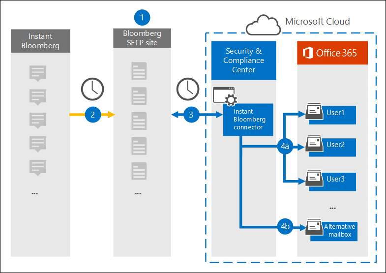

# Set up a connector to archive Instant Bloomberg data in Office 365 (Preview)

The connector feature to archive Instant Bloomberg data in Office 365 is in Preview.

Use a native connector in the Security & Compliance Center in Office 365 to import and archive financial services chat data from [Instant Bloomberg](https://www.bloomberg.com/professional/product/collaboration/) collaboration tool. After you set up and configure a connector, it connects to your organization's Bloomberg secure FTP site (SFTP) once every day, converts the content of chat messages to an email message format, and then imports those items to mailboxes in Office 365.

After Instant Bloomberg data is stored in user mailboxes, you can use Office 365 compliance features such as Litigation Hold, Content Search, In-Place Archiving, Auditing, and Office 365 retention policies to Instant Bloomberg data. For example, you can search third-party data using Content Search or associate it with a custodian in an Advanced eDiscovery case. Using an Instant Bloomberg connector to import and archive Twitter data in Office 365 can help your organization stay compliant with government and regulatory policies.

## Overview of archiving Instant Bloomberg data

The following overview explains the process of using a connector to archive Instant Bloomberg chat data in Office 365. 



1. Your organization works with Bloomberg to set up a Bloomberg SFTP site. You will also work with Bloomberg to configure Instant Bloomberg to copy chat messages to your Bloomberg SFTP site.

2. Once a day, chat messages from Instant Bloomberg are copied to the Bloomberg SFTP site.
    
3. The Instant Bloomberg connector that you create in the Security & Compliance Center connects to the Bloomberg SFTP site (on a daily basis) and transfers the chat messages to a secure Azure Storage area in the Microsoft Cloud. The connector also converts the content of a chat massage to an email message format.
    
4. The connector imports the chat message items to the mailbox of a specific user or to an alternative mailbox. The connector does by using using value of the *CorporateEmailAddress* property. Every chat message contains this property, which is populated with the email address of every participant of the chat message. Whether an item is imported into a specific user mailbox or to the alternative mailbox is based on the following criteria:
    
    a. **Items that have a value in the CorporateEmailAddress property that corresponds to an Office 365 user account** – If the connector can associate an email address in the *CorporateEmailAddress* property to a specific user account in Office 365, the item is copied to the user's Office 365 mailbox.
    
    b. **Items that have a value in the CorporateEmailAddress property that doesn't correspond to an Office 365 user account** – If the connector can't associate an email address in the *CorporateEmailAddress* property to a specific user account in Office 365, the item is copied to an alternative, "catch-all" mailbox in Office 365.

## Before you begin

Many of the implementation steps required to archive Instant Bloomberg data are external to Office 365 and must be completed before you can create the connector in the Security & Compliance Center.

- Subscribe to [Blooomberg Anywhere](https://www.bloomberg.com/professional/product/remote-access/?bbgsum-page=DG-WS-PROF-PROD-BBA). This is required so that you can log in to Bloomberg Anywhere to access the Bloomberg SFTP site that you have to set up and configure.

- Set up a Bloomberg SFTP (Secure file transfer protocol) site. After working with Bloomberg to set up the SFTP site, data from Instant Bloomberg is uploaded to the SFTP site on a daily basis. The connector you create in Step 2 connects to this SFTP site and transfers the chat data to Office 365 mailboxes. SFTP also encrypts the Instant Bloomberg chat data that is sent to Office 365 mailboxes during the transfer process.

    For information about Bloomberg SFTP (also called *BB-SFTP*):

    - See the "SFTP Connectivity Standards" document at [Bloomberg Support](https://www.bloomberg.com/professional/support/documentation/).
    
    - Contact [Bloomberg customer support](https://service.bloomberg.com/portal/sessions/new?utm_source=bloomberg-menu&utm_medium=csc).

    After you work with Bloomberg to set up an SFTP site, Bloomberg will provide some information to you after you respond to the Bloomberg implementation email message. Save a copy of the following information: You use it to set up a connector in Step 3.

    - Firm code, which is the username used to log in to the Bloomberg SFTP site.

    - Password for Bloomberg SFTP site

    - URL for Bloomberg SFTP site (for example, sftp.bloomberg.com)

    - Port number for Bloomberg SFTP site

- The user who creates an Instant Bloomberg connector in Step 2 (and who downloads the public keys and IP address in Step 1) must be assigned the Mailbox Import Export role in Exchange Online. This is required to access the **Archive third-party data** page in the Security & Compliance Center. By default, this role isn't assigned to any role group in Exchange Online. You can add the Mailbox Import Export role to the Organization Management role group in Exchange Online. Or you can create a new role group, assign the Mailbox Import Export role, and then add the appropriate users as members. For more information, see the  [Create role groups](https://docs.microsoft.com/Exchange/permissions-exo/role-groups#create-role-groups) or [Modify role groups](https://docs.microsoft.com/Exchange/permissions-exo/role-groups#modify-role-groups) sections in the article "Manage role groups in Exchange Online".

## Step 1: Obtain SSH and PGP public keys

The first step is to obtain a copy of the public keys for Secure Shell (SSH) and Pretty Good Privacy (PGP). You use these keys in Step 2 to configure the Bloomberg SFTP site to allow the connector (that you create in Step 3) to connect to the SFTP site and transfer the Instant Bloomberg chat data to Office 365 mailboxes. You also obtain an IP address in this step, which you use when configuring the Bloomberg SFTP site.

1. Go to <https://protection.office.com> and then click **Data governance \> Import** and then click **Archive third-party data**.

2. On the **Archive third-party data** page, click **Add a connector**, and then click **Instant Bloomberg**.

3. On the **Terms of service** page, click **Accept**.

4. On the **Add credentials for Bloomberg SFTP site** under step 1, click **Download public keys and IP address**.

5. Save a copy of the Keys.txt file to your local computer. This file contains the following three items that will be used to configure the Bloomberg SFTP site in Step 2:

   - SSH public key – This key will be used to configure Secure Shell (SSH) to enable a secure remote login when the connector connects to the Bloomberg SFTP site.

   - PGP public key — This key will be used to configure the encryption of data that's transferred from the Bloomberg SFTP site to Office 365.

   - IP address – The Bloomberg SFTP site will be configured to accept a connection request only from this IP address, which is used by the Instant Bloomberg connector that you create in Step 3. 

6. Click **Cancel** to close the wizard. You come back to this wizard in Step 3 to create the connector.

## Step 2: Configure the Bloomberg SFTP site

The next step is to use the SSH and PGP public keys and the IP address that you obtained in Step 1 to configure SSH authentication and PGP encryption for the Bloomberg SFTP site. This allows the Instant Bloomberg connector that you create in Step 3 to connect to the Bloomberg SFTP site and transfer Instant Bloomberg data to Office 365. Contact [Bloomberg customer support](https://service.bloomberg.com/portal/sessions/new?utm_source=bloomberg-menu&utm_medium=csc) if you need assistance setting this up.

1. Log in to the Bloomberg CCNS control panel using an account for your organization.

2. Go to CCNS and click the ****Public Keys** tab.

3. To enable SSH authentication, click **Add**.

4. In the **Add Public Key** window, click the **Key Type** dropdown list, and then click **Login**.

5. Copy the entire SSH public key (all characters between, but not including, the double quotation marks) that you downloaded in Step 1, paste it in this field, and then click **Submit** to save the key.
 
    For example, you would copy the following SSH public key:

    ```
    ssh-rsa
    AAAAB3NzaC1yc2EAAAABIwAAAQEA1dxAyc0JzCmc5NzgyzRYhnj3FGHK5Kd9T2cwZNkmL/9nFhQupQor081rmuw9gACAmeot7y+V/fmijo/q4rxDe3Auu3hfLl1NpWlIssQJHzycms8zimtdQcXbMKwDQOnRthpEocF5ySs76KE72vaYQJTvclAamWWq0D75SUmXDFFr7afvEy57F7KgMD1ecg6lH7q8seSKbiiWxX1Ul0kL15fzpUyhjDP41owb1XC/dF7fJwAmCO1+HZfDLEp62q4tnApLpdd92KoR41LZTryO5dICKhk+S+JxPLkksxL0wm5YevOr2n4ScuRdsBV8mWKZ1Xw+cOss9O6L7cCcEiB3Ow==
    ```

6. To enable PGP encryption, click **Add** again on the **Public Keys** tab, click the **Key Type** dropdown list, and this time click **Encryption**.

7. Copy the entire PGP public key (all characters between, but not including, the double quotation marks) that you downloaded in Step 1, paste it in this field, and then click **Submit** to save the key. 

    For example, you would copy the following PGP public key:

    ```
    -----BEGIN PGP PUBLIC KEY BLOCK-----
    Version: BCPG C# v1.7.4137.9688
    nmQENBFz+6UQBCACKC4ilYoVOP5b/F0CO+oQYbag79Ov4NZxM4EKW51lUAvKNExRM\nc1C/gwXm8bghht8GEODckXXqx8qSSXUEeA/ROweXNtD1u1kn7PgYEFUeD/qE739m\nm5lxXF9Vod26AtKQ9Y1EvYoQEltwztAaXg8K8LQzB+tzN079d1cxM5tbiRQLttAh\nOt5amLXuINt8+dWyNas3DfgIBUmwfkwCbUO0ElrIhvvO3A85K97SX9Q6Py0SkfkK\nQpnULuhdjSm+7k7qlVMf0s8e/9jUXYKbMFkxlOoMq052vV0l0VQNSeuKoC+m6+LT\nEPab89AMt6S4Ujum9wTUy1eWNx9vV0y/w8N7ABEBAAG0JDM5MjM4ZTg3LWI1YWIt\nNGVmNi1hNTU5LWFmNTRjNmIwN2I0MokBHAQQAQIABgUCXP7pRAAKCRAJQdjaG//S\nCy70B/wKrR2CcqtZx56yrGJFfVy3niEt16VEA3xJM3D9nX0gmgo85Nh5gkiY3ahH\nnNEmgW5vlCM1gcgFeoZWe8A80G4QoabslSUzLbq9HsHOOAQApsfhrhXpylrAVa4n\nI53XUOxWdOTa4xsOob8hSRADqJbwHPOsoAr2A87TvZ9LSi2Mii5omeTq416CLnoS\nPBAEhelZm+ruy5JhzA1yXvWYFH08wNqSHO3bskdES2yW5SyQmYlcoEztWE0Q0Z+G\nZT3kOa/W2MbcZovFCQIfqhwVfXtIzx5uYUmxgk5cFKUJJMlO0AZK/HwM22xuuIWe\ndMa6OMo/n8tvEBxrLQMdVPlz+hZ6
    =AwmP
    -----END PGP PUBLIC KEY BLOCK-----
    ```
8. Back on the main window of the CCNS control panel, under **Add your IP address here**, enter the following IP address (which is included in Keys.txt file that you downloaded in Step 1) in the **Add address field**.

   ```
   40.124.28.216
   ```

## Step 3: Create an Instant Bloomberg connector

The last step is to create an Instant Bloomberg connector in the Security & Compliance Center. The connector uses the information you provide to connect to the Bloomberg SFTP site and transfer chat messages to the corresponding user mailbox boxes in Office 365. 

1. Go to <https://protection.office.com> and then click **Data governance \> Import** and then click **Archive third-party data**.

2. On the **Archive third-party data** page, click **Add a connector**, and then click **Instant Bloomberg**.

3. On the **Terms of service** page, click **Accept**.

4. On the **Add credentials for Bloomberg SFTP site** page, under Step 3, enter the required information in the following boxes and then click **Next**.

    - **Firm code** – Username for the Bloomberg SFTP site.

    - **Password** — Password for Bloomberg SFTP site

    - **SFTP URL** – The URL for Bloomberg SFTP site (for example, sftp.bloomberg.com).

    - **SFTP port** – The port number for Bloomberg SFTP site.

5. On the **Alternative mailbox** page, type the email address of a mailbox that will be used to store chat messages from Instant Bloomberg that can't be associated with a user mailbox in your organization.

   > [!NOTE]
   > Every chat message in Instant Bloomberg includes a property called *CorporateEmailAddress*, which contains your organization's email address for each participant in the chat message. During the import process, the connector attempts to import chat messages to a user mailbox in Office 365 that has the same email addresses that matches the ones in the *CorporateEmailAddress* property. If the there isn't an Office 365 mailbox with the same address as the ones in the *CorporateEmailAddress* property, the connector imports the chat message to the alternative mailbox that you specify on this page. At this time, Instant Bloomberg chat messages archived in the alternative mailbox aren't monitored by supervision policies in Office 365.

6. Click **Next**, review your settings, and then click **prepare** to create the connector.

7. Go to the **Archive third-party data** page to see the progress of the import process for the new connector.
