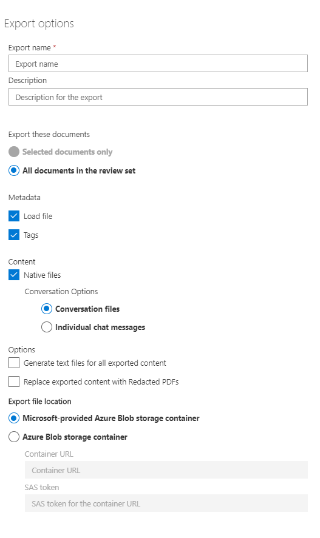

# Review conversations in Advanced eDiscovery 

Instant messaging is a convenient way to ask questions, share ideas, or quickly communicate across large audiences. As instant messaging platforms, like Microsoft Teams, become core to enterprise collaboration, organizations must evaluate how their eDiscovery workflow will address these new forms of communication and collaboration. 

The Conversation Reconstruction feature in Advanced eDiscovery is designed to help you identify contextual content and produce distinct conversation views. This capability allows you to efficiently and rapidly review complete instant message conversations (also called *threaded conversations*) that are generated in platforms like Microsoft Teams.

With Conversation Reconstruction, you can use built-in capabilities to reconstruct, review, and export threaded conversations. Use Advanced eDiscovery Conversation Reconstruction to:

- Preserve unique message-level metadata across all messages within a conversation.

- Collect contextual messages around your search results.

- Review, annotate, and redact threaded conversations.

- Export individual messages or threaded conversations

## Terminology

Here are few definitions to help you get start using Conversation Reconstruction.

- **Messages** – Represent the smallest unit of a conversation. Messages may vary in size, structure, and metadata. 

- **Conversation** – Represents a grouping of one or more messages. Across different applications, conversations may be represented in different ways. In some applications, there is an explicit action that results from replying to an existing message. Conversations are formed explicitly as a result of this user action. For example, here is a screenshot of a channel conversation in Microsoft Teams.

   

   In other apps (such as 1xN chat messages in Teams), there is not a formal reply chain and instead messages appear as a "flat river of messages" within a single thread. In these types apps, conversations are inferred from a group of messages that occur within a certain time. This "soft-grouping" of messages (as opposed to a reply chain) represent the "back and forth" conversation about a specific topic of interest. 

## Step 1: Run a search

After you have identified relevant custodians and content locations, you can create a search to find potentially relevant content. On the **Searches** tab in the Advanced eDiscovery case, you can create a new search by clicking **New search** and following the wizard. For information about how you can create a search, build a search query, and view the search results, see [Collect data for a case](create-search-to-collect-data.md).

## Step 2: Create a conversation review set

In a review set, you can search, tag, annotate, and redact documents, email messages, and chat conversations. In Advanced eDiscovery, you can customize your review of conversations, based in individual messages or threaded conversations. This is determined by the type of review set that you add the results of the of the search created in Step 1 to. There are two different types of review sets: 
  
  - **Regular review sets:** Messages in conversations are processed and displayed as individual items. 
  
  -  **Conversation review sets:** Messages in conversations are processed individually but displayed in a conversation view. In a conversation review set, you can annotate, tag, and redact messages in a threaded conversation view. 

For more information about how to review and manage content in a review set, see [Manage review sets](managing-review-sets.md). 

## Step 3: Enable conversation retrieval options

After you have reviewed and finalized your search query, you can add the search results to a review set. When you add your search results into a review set, the original data is copied to an Azure storage area to facilitate the review and analysis process. For more information about adding search results to a review set, see [Add search results to a review set](add-data-to-review-set.md). 

When you add data from conversations to a review set, you can use the conversation retrieval options to expand your search and include contextual messages. After conversation retrieval is enabled, the following can happen:
  
1. Using a keyword and date range query, the search returned a hit on *Message 3*. This message was part of a larger conversation, illustrated by *CRC1*. 
  
2. When the user adds the data into a review set and enables the conversation retrieval options, the system will go back and collect other items in *CRC1*. 
  
3. After the items have been added into a review set, the user can review all the individual messages from *CRC1*. 

  

To enable conversation retrieval:
  
1. On the **Searches** tab in the Advanced eDiscovery case, select a search, and then click **Add to review set** on the flyout page.
  
2. Select an existing review set or create a new review set. 
  
3. Ensure that you have enabled conversation retrieval for the sources that you would like to expand in your search.  
  
4. After the **Add to review set** job on the **Jobs** tab has finished, you start reviewing the conversations.

## Step 4: Review conversations in the review set

After the content has been processed and added to the review set, you can start reviewing the data in the review set. The review capabilities differ depending on whether the content was added to a regular review set or to a conversation review set. 

### Traditional Review Set
In a traditional review set, messages are processed and displayed as individual items, similar to how they are stored within a mailbox. 
> [!Note] 
> In this workflow, each message is processed as a separate item. As a result, the threaded summary and export options are not available in a traditional review set. 

### Conversational Review Set
In a Conversational Review Set, individual messages are threaded together and presented as conversations. This enables users to review and export contextual conversations. 

#### Review
In a conversational review set, you can use the following options to tailor your review process: 

##### Group by Conversation
This option groups messages within the same conversation together to help users simplify and expedite their review process. 

##### Summary View
The summary view displays the threaded conversation. Here, you can view the entire conversation and also access the metadata for each individual message.  
  - View Metadata for Individual Messages
  - Download individual messages

##### Text View
The text view provides the extracted text for the entire conversation. 

##### Annotate View
The annotate view allows the user to apply markup on a threaded view of the conversation. All messages within a conversation will share the same annotated document.

##### Tag
When viewing conversations in a review set, you can view and apply tags by clicking on the Coding Panel.

##### Re-Run Conversation Conversion
When messages are added to a conversational review set, a conversion job is automatically run to create the threaded summary and annotate views. If the Conversation Reconstruction job fails, you can re-run the conversion job by navigating to  and then  .

#### Export
In a Conversational review set, you can leverage the following options to export conversations:

##### Metadata File
Like a “load file”, this will contain metadata for each individual message, email, and document. You will see one row for each message within a conversation. 

#####	Tags
This option will allow you to include tags from your review process in your metadata file. Messages within a conversation will share the same tag. 

#####	Content
  - **Conversation files**: When you export conversation files, the annotate view is converted into a PDF and downloaded into your export folder. Messages within one conversation file will point to the same conversation file PDF.  
  - **Individual Messages:** When you export individual messages, each unique message within the conversation is exported as a standalone item. The file is exported in the same format that it is saved within the mailbox. For a given conversation, you will receive multiple .msg files. 

  >[!Warning]
  > If you applied markups to the conversation file, these will not be transferred to the individual messages. 

##### Text Files 
Text files can be generated for each conversation exported from the review set. 

#####	Replace Exported Content with Redacted PDFs
If redacted conversation files are generated during review, these files are available during export. Users can decide whether to export native files only or to replace natives that have redactions with the burned in PDFs.

>[!Note]
>To learn more about how to review case data, check out the following resources:
> - [View Case Data](view-documents-in-review-set.md) 
> - [Analyze Case Data](analyzing-data-in-review-set.md)
> - [Export Case Data](exporting-data-ediscover20.md)
