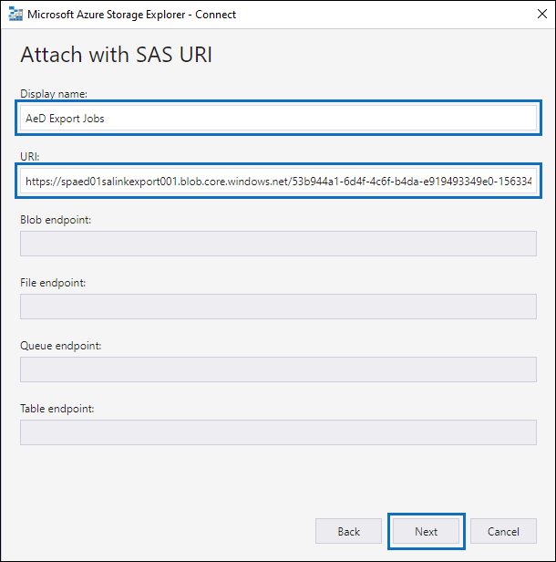
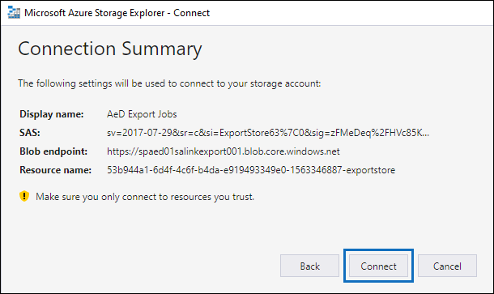
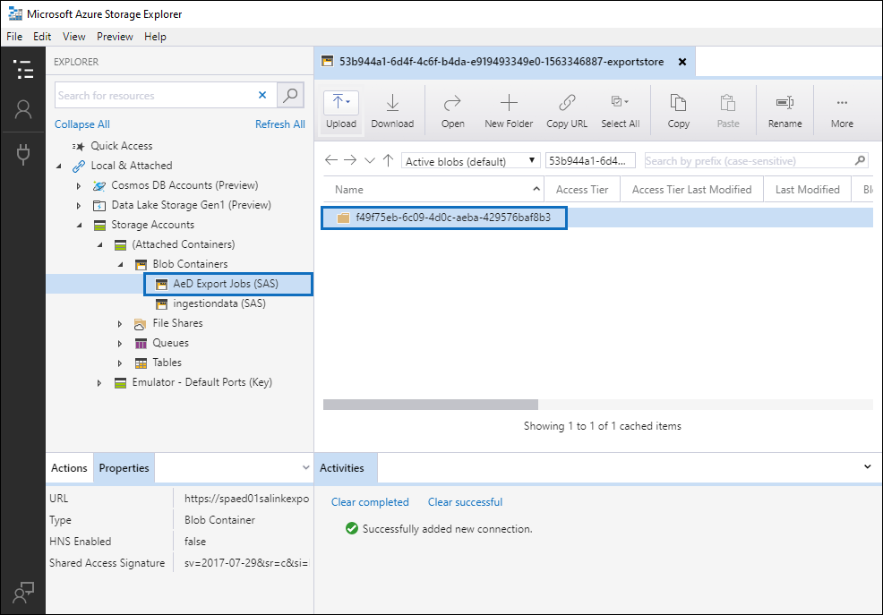

# Download export jobs

When you export documents from a review set in an Advanced eDiscovery case, the documents are uploaded to a Microsoft-provided Azure Storage location or to an Azure Storage location managed by your organization. The type of Azure Storage location used depends on which option was selected when the documents were exported. 

This article provides instructions for using the Azure Storage Explorer to connect to an Azure Storage location to browse and download the exported documents. 

All exported data is added to a Microsoft Azure blob. This provides multiple options to handle the data downstream. There are several ways to access an Azure blob. One method is to use Azure Storage Explorer. This method supports simple connection, browsing and downloading. For more information, visit <https://docs.microsoft.com/en-us/azure/storage/blobs/storage-quickstart-blobs-storage-explorer>

## Step 1: Install the Azure Storage Explorer

The first step is to download and install the Microsoft Azure Storage Explorer. For instructions, see [Microsoft Azure Storage Explorer tool](https://go.microsoft.com/fwlink/p/?LinkId=544842). You use this tool to connect to and download the exported documents in Step 3.

## Step 2: Obtain the SAS URL from the export job

The next step is to obtain the shared access signature (SAS) URL that was generated when you created an export job to [export documents from a review set](export-documents-from-review-set.md). You can copy the SAS URL for documents that were uploaded to a Microsoft-provided Azure Storage location or an Azure Storage location managed by your organization. In either case, you use the SAS URL to connect to the Azure Storage location in Step 3.

1. On the **Advanced eDiscovery** page, go to the case, and then click the **Exports** tab.

2. On the **Exports** tab, click the export job that you want to download.

3. On the flyout page, under **Locations**, copy the SAS URL that is displayed. If necessary, you can save it to a file so you can access it in Step 3.
 
   

## Step 3: Connect to the Azure Storage location

The final step is to use the Azure Storage Explorer and the SAS URL to connect to the Azure Storage location and download the documents that you exported to a local computer.

1.  Open the Azure Storage Explorer that you installed in Step 1.

2. Click the **Add account** icon. Alternatively, you can right-click **Storage Accounts**.

   

3.  On the **Connect to Azure Storage** page, click **Use a shared access signature (SAS) URI** and then click **Next**.

    

4.  On the **Attach with SAS URI** page, click in the **URI** box and then paste the SAS URL that you obtained in Step 2. Notice that a portion of the SAS URL is displayed in the **Display name** box. This will be used as the display name of the container that's create under the **Storage accounts** after you connect to the storage location.  You can keep the default display name or change it. 

    

5.  Click **Next**.

    The **Connection summary** page is displayed.
   
    

6. On the **Connection summary** page, review the connection information, and then click **Connect** . 

    The **Blob containers** node (under **Storage Accounts** > **(Attached Containers)** \> is opened. It contains a container named with the display name from step 4. This container contains a folder for each export job that you've created. These folders are named with an ID that corresponds to the ID of the export job. You can find these export IDs (and the export name) under **Support information** on the flyout page for each for each **Preparing data for export** job listed on the **Jobs** tab.

7. Double-click the export job folder to open it.

This will add the export as an object in Storage Accounts/SAS-Attached Services/Blob Containers. You will be able to explore the export and download all or portions of the export.

