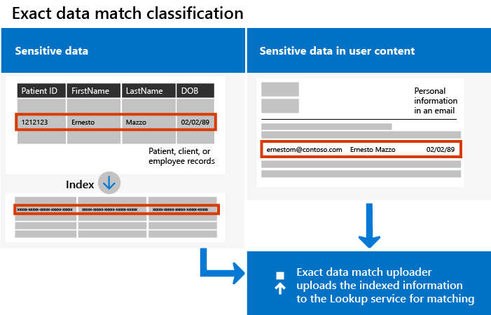

# Create custom sensitive information types with Exact Data Match (EDM) (Preview)

## Overview

With Office 365 for business, you can define [custom sensitive information types](custom-sensitive-info-types.md) that you can use to help prevent people from inadvertently or inappropriately sharing sensitive data within your organization. You can [use the Security & Compliance Center](create-a-custom-sensitive-information-type.md) or [use PowerShell](create-a-custom-sensitive-information-type-in-scc-powershell.md) to define a custom sensitive information type based on patterns, evidence (evidence includes keywords like *employee*, *badge*, *ID*, and so on), character proximity (how close evidence is to characters in a particular pattern), and confidence levels. 

But what if you wanted a custom sensitive information type that uses exact data values, instead of patterns and proximity? With Exact Data Match (EDM) classification, you can create a custom sensitive information type that:
- is dynamic (refreshable daily or weekly);
- is more scalable;
- results in fewer false-positives;
- is based on structured sensitive data;
- handles sensitive information more securely; and
- can be leveraged with several Microsoft cloud services.



EDM classification enables you to create custom sensitive information types that refer to exact values in a database of sensitive information. The database can be refreshed daily or weekly, and it can contain up to ten million rows of data. So as employees, patients, or clients come and go, and records change, your custom sensitive information types remain current and applicable. And, you can use EDM classification with policies, such as [data loss prevention policies](data-loss-prevention-policies.md) (DLP) or [Microsoft Cloud App Security file policies](https://docs.microsoft.com/cloud-app-security/data-protection-policies).

> [!NOTE]
> **EDM classification is currently in preview**, and is currently supported for Office 365 DLP and Microsoft Cloud App Security, across Exchange Online and Microsoft Teams. To participate in the preview, must have Office 365 E3, Office 365 E5, or Office 365 Advanced Compliance as an add-on. 

## Required licenses and permissions

- During the preview program, if your organization has [DLP capabilities](https://docs.microsoft.com/office365/servicedescriptions/exchange-online-protection-service-description/messaging-policy-and-compliance-servicedesc#data-loss-prevention-dlp), you can try EDM classification. If you are not already participating in the preview, [contact us](https://resources.office.com/us-landing-spe-contactus.html?LCID=EN-US) to get started.

- You must be a global admin, compliance administrator, or Exchange Online administrator to perform the tasks described in this article. To learn more about DLP permissions, see [Permissions](data-loss-prevention-policies.md#permissions).

## The work flow at a glance

|Phase  |What's needed  |
|---------|---------|
|[Part 1: Set up EDM classification](#part-1-set-up-edm-classification) |- Read access to the sensitive data<br/>- Ability to define a database schema in .xml format (this article includes an example)<br/>- Ability to create a rule package in .xml format (this article includes an example)<br/>- Admin permissions to upload the database schema file and rule package file to the Security & Compliance Center (using PowerShell) |
|(As needed)<br/>- [Edit the schema for EDM](#editing-the-schema-for-edm) <br/>- [Remove the schema for EDM](#removing-the-schema-for-edm)|- Existing edm.xml file ([defining the schema](#define-the-schema-for-your-database-of-sensitive-information)) <br/>- Admin permissions for the Security & Compliance Center (using PowerShell) |
|[Part 2: Index and upload the sensitive data](#part-2-index-and-upload-the-sensitive-data) |- Custom security group and user account on a Windows machine<br/>- Ability to install and authorize the EDM Upload Agent<br/>- Work or school account for Office 365 that has admin permissions (global administrator, compliance administrator, or Exchange Online administrator) |
|(As needed)<br/>[Refresh the database of sensitive information](#refreshing-your-sensitive-information-database) |- Read access to the sensitive data<br/>- Process or schedule for refreshing the data (.csv file)<br/>- Windows machine with EDM Upload Agent installed<br/>- Work or school account for Office 365 that has admin permissions (global administrator, compliance administrator, or Exchange Online administrator)  |
|[Part 3: Use EDM classification with your Microsoft cloud services](#part-3-use-edm-classification-with-your-microsoft-cloud-services) |- Office 365 or Microsoft 365 subscription that includes DLP<br/>- EDM classification feature enabled (this is currently in preview) |


## Part 1: Set up EDM classification

Setting up and configuring EDM classification involves saving sensitive data in .csv format, defining a schema for your database of sensitive information, creating a rule package, and then uploading the schema and rule package.

### Define the schema for your database of sensitive information

1. Identify the sensitive information you want to use. Export the data to an app, such as Microsoft Excel, and save the file in .csv format. The data file can include:

    - Up to ten million rows of sensitive data
    - Up to 32 columns (fields) per data source

2. Structure the sensitive data in the .csv file. Make sure the first row of the .csv file includes the names of the fields you'll use for EDM classification. In your .csv file, you might have field names, such as "ssn", "birthdate", "firstname", "lastname", and so on. <br/>As an example, our .csv file is called *PatientRecords.csv*. It includes columns, such as *PatientID*, *MRN*, *lastname*, *FirstName*, *SSN* and more.

3. Define the schema for the database of sensitive information in .xml format (similar to our example below). Name this schema file `edm.xml`, and configure it such that for each column in the database, there is a line that uses the syntax `<Field name="" unique="" searchable=""/>`. 

    - Use column names for *Field name* values.
    - Use `unique="true"` for the fields that contain unique values (Social Security numbers, identification numbers, etc.); otherwise, use `unique="false"`.
    - Use `searchable="true"` for the fields that should be searchable. No more than five fields per database should be searchable. All the rest should have `searchable="false"`.  

    As an example, the following .xml file defines the schema for a patient records database. Here, we specified five fields (*PatientID*, *MRN*, *SSN*, *Phone*, and *DOB*) as searchable for EDM classification. (You can copy our example and modify it for your use.)
    
    ```
        <?xml version="1.0" encoding="utf-8"?>
    <EdmSchema xmlns="http://schemas.microsoft.com/office/2018/edm">
    	<DataStore name="PatientRecords" description="Schema for patient records" version="1">
    		<Field name="PatientID" unique="true" searchable="true" />
    		<Field name="MRN" unique="false" searchable="true" />
    		<Field name="FirstName" unique="false" searchable="false" />
    		<Field name="LastName" unique="false" searchable="false" />
    		<Field name="SSN" unique="false" searchable="true" />
    		<Field name="Phone" unique="false" searchable="true" />
    		<Field name="DOB" unique="false" searchable="true" />
    		<Field name="Gender" unique="false" searchable="false" />
    		<Field name="Address" unique="false" searchable="false" />
    	</DataStore>
    </EdmSchema>
    ```

4. [Connect to Office 365 Security & Compliance Center PowerShell](https://docs.microsoft.com/powershell/exchange/office-365-scc/connect-to-scc-powershell/connect-to-scc-powershell?view=exchange-ps).

5. To upload the database schema, run the following cmdlets, one at a time:

    `$edmSchemaXml=Get-Content .\edm.xml -Encoding Byte -ReadCount 0`

    `New-DlpEdmSchema -FileData $edm -Confirm:$true`

    You will be prompted to confirm, as follows:

    ```powershell
    Confirm
        Are you sure you want to perform this action?
        New EDM Schema for the data store 'patientrecords' will be imported.
        [Y] Yes  [A] Yes to All  [N] No  [L] No to All  [?] Help (default is "Y"):
    ```

    > [!TIP]
    > If you want your changes to occur without confirmation, in Step 5, use this cmdlet instead: `New-DlpEdmSchema -FileData $edm`
    
Now that the schema for your database of sensitive information is defined, the next step is to [set up a rule package](#set-up-a-rule-package).

#### Editing the schema for EDM 

If you want to make changes to your edm.xml file, such as changing which fields are used for EDM, follow these steps:

1. Edit your edm.mxl file (this is the file discussed in the [Define the schema](#define-the-schema-for-your-database-of-sensitive-information) section of this article).

2. [Connect to Office 365 Security & Compliance Center PowerShell](https://docs.microsoft.com/powershell/exchange/office-365-scc/connect-to-scc-powershell/connect-to-scc-powershell?view=exchange-ps).

3. To update your database schema, run the following cmdlets, one at a time:

    `$edm=Get-Content .\edm.xml -Encoding Byte -ReadCount 0`

    `Set-DlpEdmSchema -FileData $edm -Confirm:$true`

    You will be prompted to confirm, as follows:

    ```powershell
    Confirm
        Are you sure you want to perform this action?
        EDM Schema for the data store 'patientrecords' will be updated.
        [Y] Yes  [A] Yes to All  [N] No  [L] No to All  [?] Help (default is "Y"):
    ```

    > [!TIP]
    > If you want your changes to occur without confirmation, in Step 3, use this cmdlet instead: `Set-DlpEdmSchema -FileData $edm`

#### Removing the schema for EDM

If you want to remove the schema you're using for EDM, follow these steps:

1. [Connect to Office 365 Security & Compliance Center PowerShell](https://docs.microsoft.com/powershell/exchange/office-365-scc/connect-to-scc-powershell/connect-to-scc-powershell?view=exchange-ps).

2. Run the following PowerShell cmdlet, substituting the data store name of "patientrecords" with the one you want to remove:

    `Remove-DlpEdmSchema -Identity patientrecords`

     You will be prompted to confirm, as follows:
    
    ```powershell
    Confirm
    Are you sure you want to perform this action?
    EDM Schema for the data store 'patientrecords' will be removed.
    [Y] Yes  [A] Yes to All  [N] No  [L] No to All  [?] Help (default is "Y"):
    ```
    
    > [!TIP]
    > If you want your changes to occur without confirmation, in Step 2, use this cmdlet instead: `Remove-DlpEdmSchema -Identity patientrecords -Confirm:$false`

### Set up a rule package

1. Create a rule package in .xml format (with Unicode encoding), similar to the example included below. (You can copy our example and modify it for your use.) 

    Recall from the previous procedure that our PatientRecords schema defines five fields as searchable for EDM: *PatientID*, *MRN*, *SSN*, *Phone*, and *DOB*. Our example file includes those fields, listed as *ExactMatch* items. 

    ```
    <?xml version="1.0" encoding="utf-8"?>
    <RulePackage xmlns="http://schemas.microsoft.com/office/2018/edm">
      <RulePack id="fd098e03-1796-41a5-8ab6-198c93c62b11">
        <Version build="0" major="2" minor="0" revision="0" />
        <Publisher id="eb553734-8306-44b4-9ad5-c388ad970528" />
        <Details defaultLangCode="en-us">
          <LocalizedDetails langcode="en-us">
            <PublisherName>IP DLP</PublisherName>
            <Name>Health Care EDM Rulepack</Name>
            <Description>This rule package contains the EDM sensitive type for health care sensitive types.</Description>
          </LocalizedDetails>
        </Details>
      </RulePack>
      <Rules>
        <ExactMatch id = "E1CC861E-3FE9-4A58-82DF-4BD259EAB370" patternsProximity = "300" dataStore ="PatientRecords" recommendedConfidence = "65" >
          <Pattern confidenceLevel="65">
            <idMatch matches = "PatientID" classification = "Patient ID" />
    	<match matches="LastName" />
          </Pattern>
        </ExactMatch>
        <ExactMatch id = "E1CC861E-3FE9-4A58-82DF-4BD259EAB371" patternsProximity = "300" dataStore ="PatientRecords" recommendedConfidence = "65" >
          <Pattern confidenceLevel="65">
            <idMatch matches = "SSN" classification = "U.S. Social Security Number (SSN)" />
          </Pattern>
        </ExactMatch>
        <ExactMatch id = "E1CC861E-3FE9-4A58-82DF-4BD259EAB372" patternsProximity = "300" dataStore ="PatientRecords" recommendedConfidence = "65" >
          <Pattern confidenceLevel="65">
            <idMatch matches = "MRN" classification = "MRN" />
    	<match matches="LastName" />
          </Pattern>
        </ExactMatch>
        <ExactMatch id = "E1CC861E-3FE9-4A58-82DF-4BD259EAB373" patternsProximity = "300" dataStore ="PatientRecords" recommendedConfidence = "65" >
          <Pattern confidenceLevel="65">
            <idMatch matches = "Phone" classification = "Phone Number" />
    	<match matches="LastName" />
          </Pattern>
        </ExactMatch>
        <LocalizedStrings>
          <Resource idRef="E1CC861E-3FE9-4A58-82DF-4BD259EAB370">
            <Name default="true" langcode="en-us">PatientID Exact Match.</Name>
            <Description default="true" langcode="en-us">EDM Sensitive type for detecting Patient ID.</Description>
          </Resource>
          <Resource idRef="E1CC861E-3FE9-4A58-82DF-4BD259EAB371">
            <Name default="true" langcode="en-us">Patient SSN Exact Match.</Name>
            <Description default="true" langcode="en-us">EDM Sensitive type for detecting Patient SSN.</Description>
          </Resource>
          <Resource idRef="E1CC861E-3FE9-4A58-82DF-4BD259EAB372">
            <Name default="true" langcode="en-us">Patient MRN Exact Match.</Name>
            <Description default="true" langcode="en-us">EDM Sensitive type for detecting Patient MRN.</Description>
          </Resource>
          <Resource idRef="E1CC861E-3FE9-4A58-82DF-4BD259EAB373">
            <Name default="true" langcode="en-us">Patient Contact Exact Match.</Name>
            <Description default="true" langcode="en-us">EDM Sensitive type for detecting Patient Contact.</Description>
          </Resource>
        </LocalizedStrings>
      </Rules>
    </RulePackage>
    ```
       
    (To learn more about .xml files like this, see [Sample XML of a rule package](create-a-custom-sensitive-information-type-in-scc-powershell.md#sample-xml-of-a-rule-package).)
    
2. Upload the rule package by running the following PowerShell cmdlets, one at a time:

    `$rulepack=Get-Content .\rulepack.xml -Encoding Byte -ReadCount 0`

    `New-DlpSensitiveInformationTypeRulePackage -FileData $rulepack`

    To learn more about uploading rule packages, see [Upload your rule package](create-a-custom-sensitive-information-type-in-scc-powershell.md#upload-your-rule-package).

At this point, you have set up EDM classification. The next step is to index and upload the sensitive data. 

## Part 2: Index and upload the sensitive data

During this phase, you set up a custom security group and user account, and set up the EDM Upload Agent tool. Then, you use the tool to index the sensitive data, and upload the indexed data.

### Set up the EDM Upload Agent

1. As an administrator on a Windows machine, create a security group and name it `EDM_DataUploaders`. Then add the EDM_DataUploaders security group to the Administrators group in Windows.

2. Create a new user account for the Windows machine, and add that account to the EDM_DataUploaders security group.

3. Sign out of Windows, and then sign back in using the new user account. 

5. Download and install the EDM Upload Agent at [https://go.microsoft.com/fwlink/?linkid=2088639](https://go.microsoft.com/fwlink/?linkid=2088639).  

6. To authorize the EDM Upload Agent, open Windows Command Prompt and run the following command:

    `EdmUploadAgent.exe /Authorize`

    You'll be prompted to sign in. Use your work or school account for Office 365 (you must be a global admin, compliance administrator, or Exchange Online administrator).

The next step is to use the EDM Upload Agent to index the sensitive data, and then upload the indexed data.

### Index and upload the sensitive data

1. Save the sensitive data file (recall our example is *PatientRecords.csv*) to the local drive on the machine. (We saved our example *PatientRecords.csv* file to `C:\Edm\Data`.)

2. To index the sensitive data, run the following command in Windows Command Prompt:

    `EdmUploadAgent.exe /CreateHash /DataStoreName <DataStoreName> /DataFile <DataFilePath> /HashLocation <HashedFileLocation>`

    Example: `EdmUploadAgent.exe /CreateHash /DataStoreName PatientRecords /DataFile C:\Edm\Data\PatientRecords.csv /HashLocation C:\Edm\Hash` 

3. To upload the indexed data, run the following command in Windows Command Prompt:

    `EdmUploadAgent.exe /UploadHash /DataStoreName <DataStoreName> /HashFile <HashedSourceFilePath>`

    Example: `EdmUploadAgent.exe /UploadHash /DataStoreName PatientRecords /HashFile C:\Edm\Hash\PatientRecords.EdmHash` 

4. To verify your sensitive data has been uploaded, run the following command in Windows Command Prompt:

    `EdmUploadAgent.exe /GetDataStore`

    You'll see a list of data stores and when they were last updated, similar to the following: <br/>

    > [!TIP]
    > [Use Task Scheduler to save time](#use-task-scheduler-to-save-time).

At this point, you are ready to use EDM classification with your Microsoft cloud services. For example, you can [set up a DLP policy using EDM classification](#to-create-a-new-dlp-policy-with-edm). 

### Refreshing your sensitive information database

You can refresh your sensitive information database daily or weekly. When your .csv file is refreshed, use the EDM Upload Tool to re-index the sensitive data and then re-upload the indexed data. To get help with this, see [Index and upload the sensitive data](#index-and-upload-the-sensitive-data) (in this article). 

### Use Task Scheduler to save time

We recommend setting up a regular schedule and process for updating the .csv file, and using [Task Scheduler](https://docs.microsoft.com/windows/desktop/TaskSchd/task-scheduler-start-page) to automate the steps of indexing sensitive data and uploading the indexed data.

You can schedule tasks using several methods:

|Method  |What to do  |
|---------|---------|
|Windows PowerShell     |See the [ScheduledTasks](https://docs.microsoft.com/powershell/module/scheduledtasks/?view=win10-ps) documentation and our [example PowerShell script](#example-powershell-script)|
|Task Scheduler API |See the [Task Scheduler](https://docs.microsoft.com/windows/desktop/TaskSchd/using-the-task-scheduler) documentation |
|Windows user interface     |In Windows, click **Start**, and type `Task Scheduler`. Then, in the list of results, right-click **Task Scheduler**, and choose **Run as administrator**.          |

#### Example PowerShell script

Here's an starter PowerShell script you can use to schedule your tasks for indexing data and uploading the indexed data:

```powershell
param([string]$dataStoreName,[string]$fileLocation)
# Assuming current user is also the user context to run the task
$user = "$env:USERDOMAIN\$env:USERNAME"
$edminstallpath = 'C:\Program Files\Microsoft\EdmUploadAgent\'
$edmuploader = $edminstallpath + 'EdmUploadAgent.exe'
$csvext = '.csv'
$edmext = '.EdmHash'
# Assuming CSV file name is same as data store name
$dataFile = "$fileLocation\$dataStoreName$csvext"
$hashFile = "$fileLocation\$dataStoreName$edmext"
# Assuming location to store hash file is same as the location of csv file
$hashLocation = $fileLocation
$createHashArgs = '/CreateHash /DataStoreName ' + $dataStoreName + ' /DataFile ' + $dataFile + ' /HashLocation ' + $hashLocation
$uploadHashArgs = '/UploadHash /DataStoreName ' + $dataStoreName + ' /HashFile ' + $hashFile
# Set up actions associated with the task
$actions = @()
$actions += New-ScheduledTaskAction -Execute $edmuploader -Argument $createHashArgs -WorkingDirectory $edminstallpath
$actions += New-ScheduledTaskAction -Execute $edmuploader -Argument $uploadHashArgs -WorkingDirectory $edminstallpath
# Set up trigger for the task
$trigger = New-ScheduledTaskTrigger -Weekly -DaysOfWeek Sunday -At 2am
# Set up task settings
$principal = New-ScheduledTaskPrincipal -UserId $user -LogonType S4U -RunLevel Highest
$settings = New-ScheduledTaskSettingsSet -RunOnlyIfNetworkAvailable -StartWhenAvailable -WakeToRun
# Create the scheduled task
$scheduledTask = New-ScheduledTask -Action $actions -Principal $principal -Trigger $trigger -Settings $settings
# Get credentials to run the task
$creds = Get-Credential -UserName $user -Message "Enter credentials to run the task"
$password=[Runtime.InteropServices.Marshal]::PtrToStringAuto([Runtime.InteropServices.Marshal]::SecureStringToBSTR($creds.Password))
# Register the scheduled task
$taskName = 'EDMUpload_' + $dataStoreName
Register-ScheduledTask -TaskName $taskName -InputObject $scheduledTask -User $user -Password $password
```

## Part 3: Use EDM classification with your Microsoft cloud services

EDM can be used with information protection features, such as [Office 365 DLP policies](data-loss-prevention-policies.md) and [Microsoft Cloud App Security file policies](https://docs.microsoft.com/cloud-app-security/data-protection-policies). As an example, the following procedure describes how to use EDM with a DLP policy that is created in the Office 365 Security & Compliance Center.

### To create a new DLP policy with EDM

1. Go to the Security & Compliance Center ([https://protection.office.com](https://protection.office.com)).

2. Choose **Data loss prevention** > **Policy**.

3. Choose **Create a policy** > **Custom** > **Next**.

4. On the **Name your policy** tab, specify a name and description, and then choose **Next**.

5. On the **Choose locations** tab, select **Let me choose specific locations**, and then choose **Next**.<br/><br/>

6. In the **Status** column, select **Exchange email** only, and then choose **Next**. <br/><br/>

7. On the **Policy settings** tab, choose **Use advanced settings**, and then choose **Next**.<br/><br/>

8. Choose **+ New rule**.<br/><br/>

9. In the **Name** section, specify a name and description for the rule.<br/><br/>

10. In the **Conditions** section, in the **+ Add a condition** list, choose **Content contains sensitive type**.<br/><br/>

11. Search for the sensitive information type you created when you defined a rule package in [Part 4](#part-4-create-a-rule-package-with-exact-matching), and then choose **+ Add**.<br/><br/>Then choose **Done**.

12. Finish selecting options for your rule, such as **User notifications**, **User overrides**, **Incident reports**, and so on, and then choose **Save**.

13. On the **Policy settings** tab, review your rule(s), and then choose **Next**.

14. Specify whether to turn on the policy right away, test it out, or keep it turned off. Then choose **Next**.

15. On the **Review your settings** tab, review your policy. Make any needed changes. When you're ready, choose **Create**.

> [!NOTE]
> Allow approximately one hour for your new DLP policy to work its way through your data center.

## Related articles

[Built-in sensitive information types and what they look for](what-the-sensitive-information-types-look-for.md)

[Custom sensitive information types](custom-sensitive-info-types.md)

[Overview of DLP policies](data-loss-prevention-policies.md)

[Microsoft Cloud App Security](https://docs.microsoft.com/cloud-app-security)