# Prerequisites

1.  You need to have a Twitter account. (This sample connector currently allow importing data on your company’s Official Twitter handles

2.  You should have a valid Azure Subscription
    
    1.  If you don’t have an existing Azure Subscription, you can either get
        
        1.  Free subscription (valid for 1 year) [here](https://azure.microsoft.com/en-us/free/)
        
        2.  Pay as you go subscription [here](https://azure.microsoft.com/en-us/pricing/purchase-options/pay-as-you-go/)

# Set up

1.  Make sure the user who is setting up connector has Mailbox Import Export role.

> For more information see the "Add a role in a role group" or the "Create a role group" sections in [Manage role groups](https://docs.microsoft.com/en-us/exchange/manage-role-groups-exchange-2013-help)

2.  Ensure that you have accepted the consent by following the steps in the below link. Tenant admin has to click below link and log in with their credential.
    
    1.  [https://login.microsoftonline.com/common/oauth2/authorize?client\_id=570d0bec-d001-4c4e-985e-3ab17fdc3073\&response\_type=code\&redirect\_uri=https://portal.azure.com/\&nonce=1234\&prompt=admin\_consent](https://login.microsoftonline.com/common/oauth2/authorize?client_id=570d0bec-d001-4c4e-985e-3ab17fdc3073&response_type=code&redirect_uri=https://portal.azure.com/&nonce=1234&prompt=admin_consent)

3.  Ensure that you have an active Azure subscription as mentioned in Prerequisites point \#2

4.  Create AAD app using [Azure portal](https://portal.azure.com). Follow the below steps or refer [Create AAD App](#step-2-create-aad-app) with screen shots
    
    2.  Azure Active Directory -\> App Registrations -\> New Application Registration Name of App : - i.e. TwitterConnector or any preferable name

> Application type : - Web app / API
> 
> Sign on URL : - [https://portal.azure.com](https://portal.azure.com)

3.  Register App and note **AAD APP ID **

4.  Go to app -\> Settings -\> Keys -\> Fill Passwords details -\> Save keys -\> Copy **Password** value and save it to your secret location. This will be used when configuring the Connector.

<!-- end list -->

5.  Create storage account using [Azure portal](https://portal.azure.com). Follow the below steps or refer [Storage account creation](#step-3-storage-account-creation) with screen shots
    
    5.  Create a new Storage Account (Create a resource -\> Storage -\> Storage Account) -\> Fill details -\> Review & Create -\>It will take some time)
    
    6.  Go to Storage account created above -\> Copy primary **connection string** and save it to a secret location. This will be used during deployment.

6.  Create a Twitter developer App
    
    7.  Refer screenshot [Twitter App Registration](#step-5-twitter-app-registration) or follow documentation on [Twitter developer portal](https://developers.facebook.com/docs/pages/getting-started/).

# Finalize

1.  Download the builds of connector code and unzip it. It would have a single file
    
      - SampleConnector.zip

2.  Deploy the web app in Azure
    
      - Follow the step as mentioned in [App Service creation](#step-4-app-service-creation)
    
      - Note your App Service URL required for Twitter App creation and Connector setup in SCC

3.  Configure Login and Webhook products on Twitter developer portal
    
      - RedirectUrl in Settings of Login product should be
        
          - \<App Service URL\>/Views/TwitterOAuth

4.  Go to SCC portal <https://protection.office.com>

5.  Go to Data Governance \> Import. and follow the onscreen steps. [\[Refer Screenshots here\]](#step-7-connector-setup-in-scc)

## Step 1: Download the package

Download the prebuilt package from repository’s Release section,

To be Added

## Step 2: Create an app in Azure Active Directory

1.  Go to Azure portal, portal.azure.com

3.  Go to Azure Active Directory

4.  Go to App registration

5.  Register an App

6.  Make a note of the **AAD App Id**

7.  Go to Certificates and secrets

8.  Click new client secret

9.  Create new secret

10. Make a note of the secret

11. Go to Manifest-\> Make a note of the identifierUris \[Also called app id uri\] as highlighted in the below image

## Step 3: Create an Azure storage account

1.  Go to Azure home page

12. Go to create a resource

13. Select storage and click storage account

14. Create storage account

15. Select or create resource group

16. Provide storage account name

17. Verify and create resource

18. Go to the storage account resource

19. Go to access keys

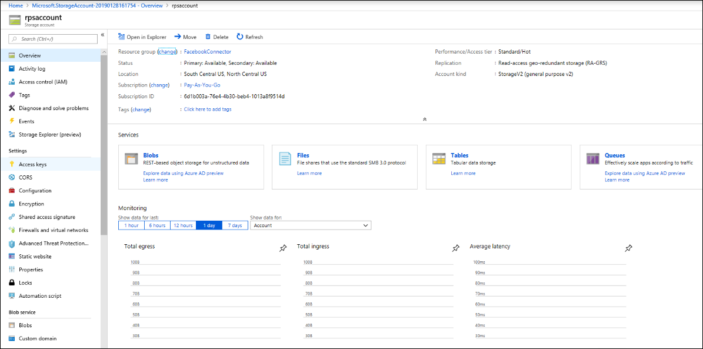

20. Make a note of the connection string

## Step 4: Create a new web app resource in Azure

1.  Create new Web App resource (App Service of type Web App)

#### Fill the details as shown below and create Web App

2. Go to the newly created Web App resource and fill all the settings as displayed with the values you noted above

Add the below 3 application settings with appropriate values

  - APISecretKey – the seed password needed to configure the connector service

  - StorageAccountConnectionString – value you have noted after you create storage account

  - tenantId – your O365 tenant id

3. Turn the Enabled setting in Application Settings to Always On

4. Upload the app service bits (zip file downloaded as mentioned above) using the below url

\<AppService\>.scm.azurewebsites.net/ZipDeployUi

## Step 5: Register the Twitter app

1. Go to https://developer.twitter.com, log in using the credentials for the developer account for your organization, and then click **Create an app**.

2.  Add new Application

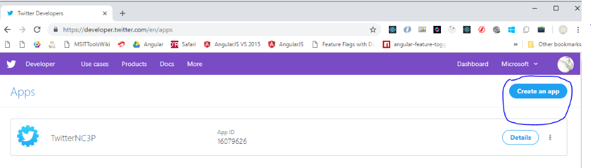

3. Add App Details

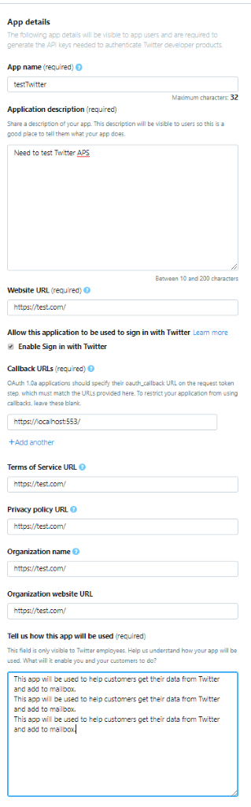

4. Edit Details for App. Click on Details for given app from dashboard <https://developer.twitter.com/en/apps>

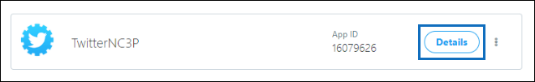

5. Generate Access Token

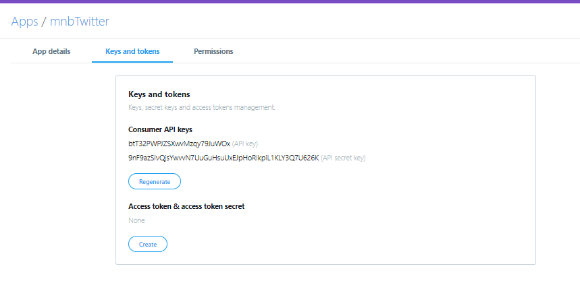

6. Update Permissions

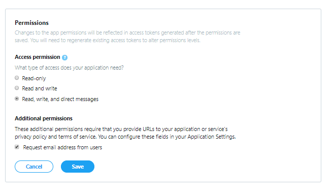

7. Add OAuth redirect URI \<connectorserviceuri/Views/TwitterOAuth\>

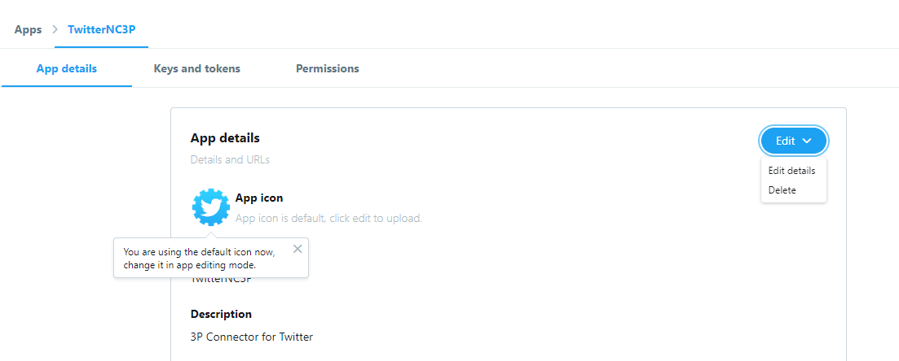

8. Select Edit Details. Update Callback Url in Callback URLs Section and Save

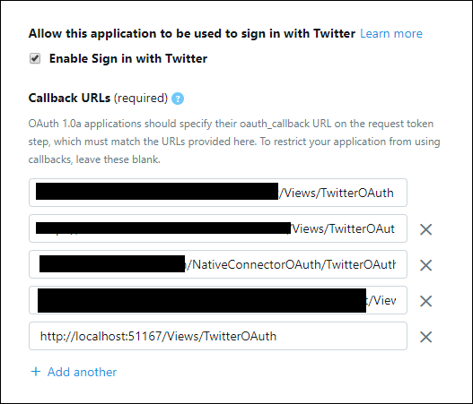

9. 
Your Developer App is now ready to use

## Step 6: Configure the connector web app

1. Go to https://\<AzureAppResourceName>.azurewebsites.net (where AzureAppResourceName is the name of your Azure app resource that you named in Step 4) For example, if the name is **twitterconnector**, go to https://twitterconnector.azurewebsites.net. The home page of the app will look like the following screenshot.

   

2. Click **Configure** to display a sign in page.

    

3. In the Tenant Id box, type or paste your tenant Id (that you obtained in Step 2). In the password box, type or paste the APISecretKey (that you obtained in Step 2), and then click **Set Configuration Settings** to display the **Configuration Details** page.

   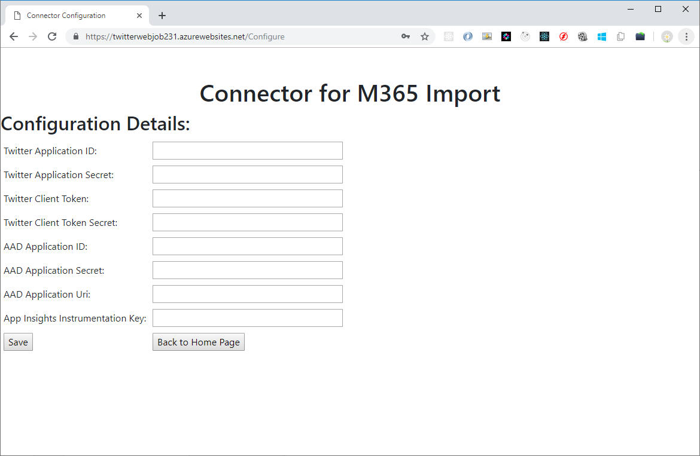

4. Under **Configuration Details**, enter the following configuration settings 

   - **Twitter application ID** - The app ID for the Facebook application that you obtained in Step 5.
   - **Twitter application secret** - The app secret for the Facebook application that you obtained in Step 5.
   - **Twitter client token** - The verify token that you created in Step 5.
   - **Twitter client token secret** - The application ID for the Azure Active Directory app that you created in Step 2
   - **AAD application ID** - The application ID for the Azure Active Directory app that you created in Step 2
   - **AAD application secret** - The value for the APISecretKey secret that you created in Step 4.
   - **AAD application Uri** - The AAD application Uri obtained in Step 2; for example, https://microsoft.onmicrosoft.com/2688yu6n-12q3-23we-e3ee-121111123213.
   - **App insights instrumentation key** - Leave this box blank.

5. Click **Save** to save the connector settings.

## Step 7: Set up a custom connector in the Security & Compliance Center

1.  Go to Data Governance \> Import and click Archive third-party data

33. Click Add connector button and select custom

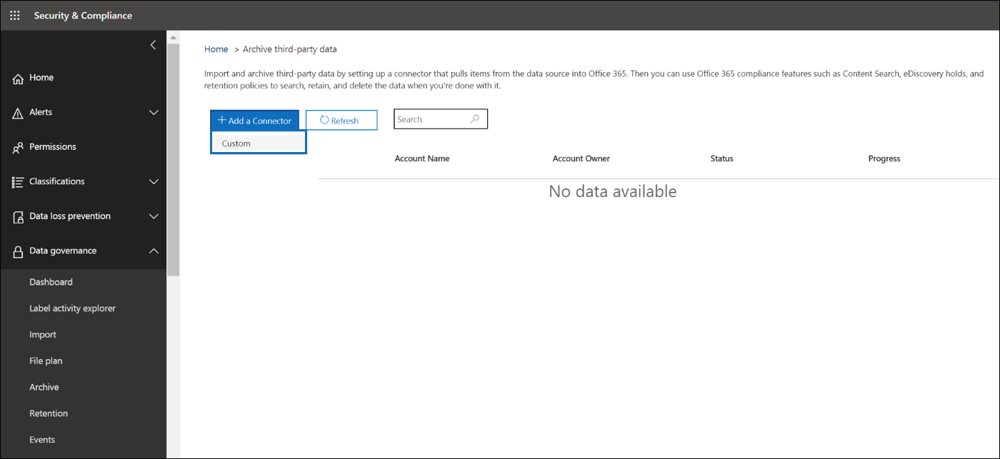

34. Provide Connector App details and click Next

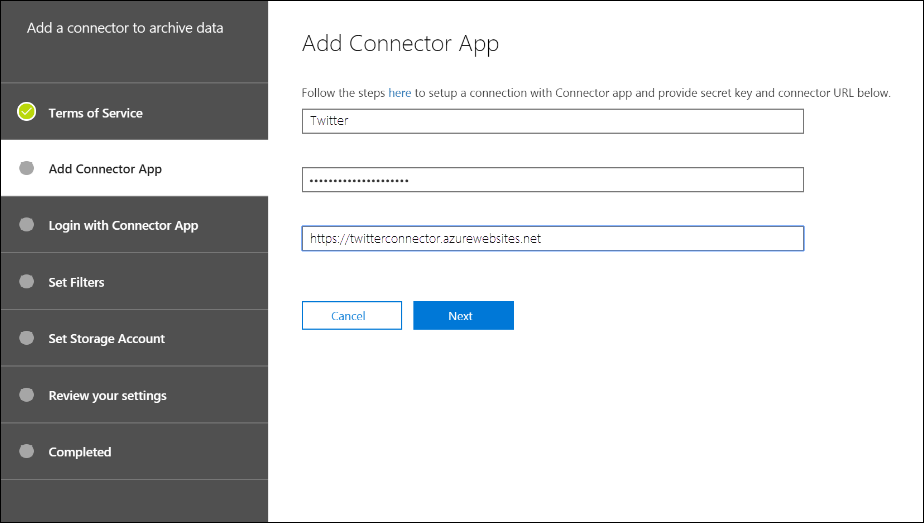

Fill the name as Twitter

Provide API secret key and connector URL as created in Finalize step 4

35. Click Login with Connector App

36. Provide secret and click login to connector service

Secret key is same as the one entered in step above

37. *Login with Twitter*

> 

38. Twitter login dialog will open. Provide username, password and log in with Twitter.

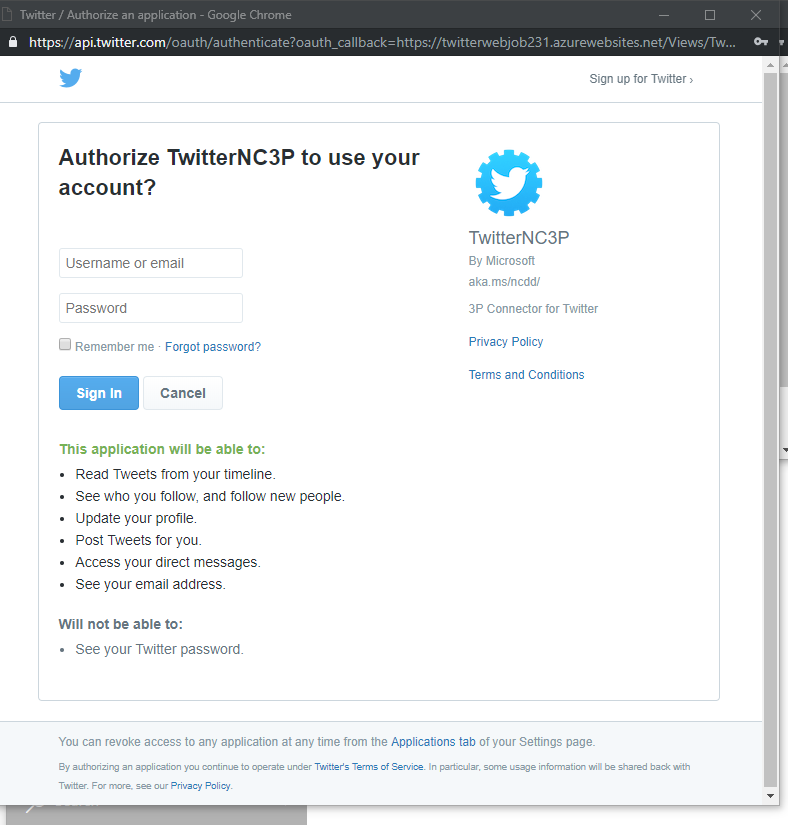

39. Complete Job Setup

40. Apply filters. You can select the duration of data to bring in

41. Specify user/mailbox to store Twitter data

42. Review settings and finish connector setup

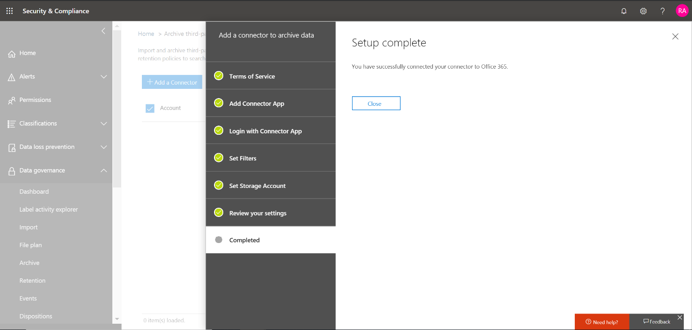

43. You can see the progress of import in the dashboard

